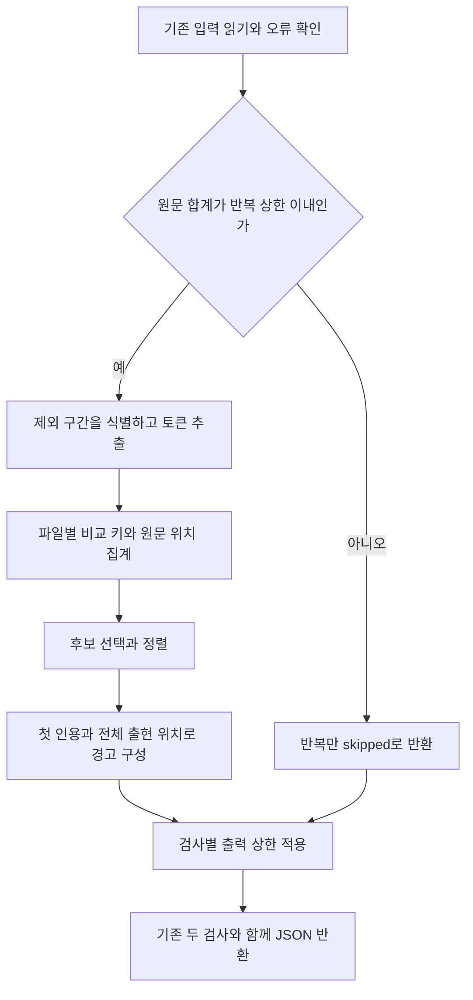

# 문서 의미 판단과 반복 탐지 개선 계획

독자가 문서에서 대상, 행동, 조건과 근거의 시점을 구별하도록 기존 문서별 판단을 먼저 구체화한다. 이어서 고정 표현 후보와 파일별 반복 후보를 추가하고, 원문 위치를 근거로 대체 문장을 판단하도록 연결한다. 이 계획은 `use-better-terms`를 수정할 개발자를 위한 실행 계획이며, 코드 변경이나 개선 효과의 확인을 뜻하지 않는다.

## 적용할 요구사항과 결정

기준은 [요구사항](requirements.md)의 `개선할 결과`, `먼저 적용할 개선`, `반복 표현 탐지와 대안 탐색`, `반복 검사의 적용 조건`과 `완료를 확인할 자료`다. 문서 의미 판단은 U1, 고정 후보는 U2, 반복 계산은 U3, CLI 결과와 스킬의 연결은 U4에서 다룬다. 각 작업의 확인은 요구사항의 `주의`에 따라 마지막 단계에 한 번 모아서 수행한다.

수치, 본문 제외 규칙, 형태 합산과 JSON의 기준은 [반복 검사 결정 이력](decisions/repetition-aggregation-and-output.md)에 둔다. 계획에서 이 규칙을 다시 정의하지 않는다. [문서 이해 조사](references/document-comprehension-research.md)의 다른 개선 후보는 모두 구현할 목록이 아니며, 기존 지침 한 곳의 구체화를 먼저 적용한다.

개발에는 [개발 지침](../../dev/README.md)과 [Node.js ESM CLI 지침](../../dev/node/mjs-cli.md)을 적용한다. 기존 세 배포 파일, 외부 패키지 없는 실행, 입력 오류 처리와 등록 표현의 기존 탐지는 유지한다. 정확히 두 검사라는 전제는 U4에서 세 검사에 맞게 갱신한다.

## 실행 순서와 처리 단계

U1부터 U4까지 순서대로 진행한다. U2와 U3은 같은 표현 모듈 및 자체 검사 코드를 바꾸므로 동시에 수정하지 않는다. U3에서 반복 계산을 완성한 뒤 U4에서 CLI에 연결한다. U1과 U4가 함께 고치는 `SKILL.md`에서는 앞 작업의 의미 판단 기준을 보존한다.

반복 검사 내부의 순서는 다음과 같다. 그림은 결정 기록의 처리 순서를 보여 주며, 기존 두 검사에 새로운 입력 제한을 적용한다는 뜻이 아니다.

## 작업 단위

### U1. 문서에서 빠진 관계를 판단하는 기준 구체화

`대상과 행동`, `조건과 근거의 시점`, `결론과 미확인 사항`을 [SKILL.md](../../../skills/use-better-terms/SKILL.md)의 기존 문서별 판단 항목 한 곳에 반영한다. [문서 이해 조사](references/document-comprehension-research.md)의 `기존 지침의 한 부분을 구체적으로 고친다`를 기준으로 삼는다. 별도 단계나 여러 참고 자료에 같은 지시를 덧붙이지 않는다.

문서에 필요한 정보가 자료에 있는데 빠진 경우와 자료에도 없는 경우를 구별하게 한다. 역할과 실행 상태, 조건의 선후 관계, 현재 관측과 변경 후 확인을 혼동하지 않도록 기존 기준을 구체화한다. 문서의 설명, 작성된 코드와 실행 기록이 다르면 그 차이를 밝히며, 결론에서 현재 판단과 필요한 다음 행동을 찾을 수 있게 한다. 전문용어와 조사 결합을 고칠 때도 원래의 대상과 조건을 보존한다.

완료 근거는 기존 최종 문서 판단에서 확인한다. 이미 있는 [재작성 평가 사례](../better-terms-rewrite-depth-7c1d/references/rewrite-review-evaluation-cases.md)와 문서 이해 조사의 가상 사례를 사용하며, 새 점수표나 후보별 스킬을 만들지 않는다.

- 근거에 있는 주체나 시점을 문장에 복원하고, 근거에도 없으면 확인할 사실을 남긴다.
- 현재 자료로 아직 적용하지 않은 변경의 효과를 입증하지 않는다. 자료가 있는지 모르는 상태를 자료가 없다는 사실로 바꾸지 않는다.
- 정확한 전문용어가 가리키는 서로 다른 개념을 합치지 않으며, 이미 분명한 설명은 불필요하게 바꾸지 않는다.
- 문장 성분과 조건의 연결을 고친 뒤에도 독자가 판단할 사항과 유일한 불확실성 설명이 남아 있다.

이 사례에서 뜻을 보존한 재작성이 가능했더라도 여러 실행에서 같은 개선이 나타난다는 증거는 아니다. 스크립트 검사로 문서 의미의 정확도를 대신 판정하지 않는다.

### U2. 업무, 지위와 소비를 고정 후보에 추가

`반복 표현 탐지와 대안 탐색`의 세 표현을 [korean-expressions.mjs](../../../skills/use-better-terms/scripts/korean-expressions.mjs)의 기존 표현 규칙에 추가한다. 질문과 유지 사례도 같은 규칙 자료에 둔다. 반복 횟수와 관계없이 각 표현을 직접 알리며, 자동 치환 목록으로 만들지 않는다.

[scan.mjs](../../../skills/use-better-terms/scripts/scan.mjs)의 기존 자체 검사에서 세 표현을 각각 한 번만 넣은 입력이 그 표현의 규칙을 내는지 확인한다. 다른 단어의 경고로 성공을 대신하지 않는다. 기존 부분 일치, 활용형, phrase 규칙과 겹치는 경고의 동작은 유지한다.

의미 판단에서는 실제 맡은 일을 뜻하는 `업무`, 법률상 `지위`, 전력 `소비`처럼 정확한 사용을 유지할 수 있어야 한다. 하나의 명사가 서로 다른 동작을 감추는 사례에는 동작과 조건이 드러나는 문장 대안을 찾는다. 고정 후보의 탐지 성공과 대안의 의미 보존은 별도로 확인한다.

### U3. 반복 계산과 원문 위치 제공

`반복 검사의 적용 조건`과 결정 기록의 `입력 상한과 초과 처리`, `후보 판정식과 본문 선택`, `형태 합산`, `알고리즘과 파일 구성`을 구현한다. 변경 대상은 `korean-expressions.mjs`와 기존 자체 검사를 담은 `scan.mjs`다. 반복 계산은 기존 표현 모듈의 `scanRepetition(sources)`로 제공하며, U4 전까지 CLI의 검사 배열은 바꾸지 않는다.

원문 크기를 먼저 확인하고, 허용된 입력에서만 제외 구간과 토큰을 추출한다. 원문 위치는 유지한 채 비교 키만 정규화한다. 등록 활용형은 `buildForms()`에서 표제어 관계를 얻고, 반환된 경고나 표제어 정보가 사라진 descriptor를 합산 근거로 사용하지 않는다.

키별 횟수와 위치는 파일별 `Map`에 모은다. 기호의 짝은 위치 색인이나 단방향 탐색으로 처리하며, 열리는 기호마다 원문 끝까지 다시 찾지 않는다. 긴 문단 검사의 추출 함수는 포함 대상과 위치 계산이 다르므로 그대로 재사용하지 않는다. 같은 입력에 같은 위치와 인용을 계산하는 부분만 재사용한다.

자체 검사에는 다음 동작을 확인할 입력을 포함한다. 결정 기록의 제외 규칙마다 입력과 기대값을 정하며, 완전한 Markdown 해석을 기대값으로 삼지 않는다.

- 빈 입력과 숫자만 있는 입력은 후보가 없다. 원문 합계 20,000 코드 포인트는 계산하고 20,001은 반복 전체를 미실행으로 처리한다. 파일별로는 상한 이내여도 합계가 넘으면 일부 파일만 계산하지 않는다.
- 공백, Markdown 표기, CRLF, 보조 평면 문자, NFD와 decoder의 맨 앞 BOM 처리가 크기 계산의 기준과 맞는다. 정규화 후 길이로 상한을 판단하지 않는다.
- 같은 파일의 2회 출현은 제외한다. 분모 300에 3회는 포함하고 분모 301에 3회는 제외한다. 서로 다른 파일에 한 번씩 있는 표현을 합쳐 3회로 만들지 않는다.
- `검토`, `검토를`, `검토가`는 합산하고 `검토에서는`은 별개로 센다. `소비자`를 `소비`에 합치지 않는다. 미등록 명사의 조사를 추측해 제거하지 않는다.
- 표제어가 하나인 등록 활용형만 합산한다. 여러 표제어나 명사 해석이 충돌하면 표기대로 남기며, phrase와 기존 고정 경고의 결과는 바뀌지 않는다.
- NFC와 NFD의 같은 표기를 합산해도 원문 토큰과 위치는 각각 보존한다. 대소문자, 한 글자 토큰의 분모 포함, 숫자 및 결합 문자만 있는 구간의 제외가 결정과 맞는다.
- 제목과 목록의 산문은 포함하고 코드, 인용 블록, URL 등은 정한 범위에서 제외한다. 제외 구간 양옆의 글자를 붙이지 않으며, 닫히지 않은 표기와 중첩 괄호도 정한 끝에서 처리를 마친다.
- 각 토큰은 한 키에만 들어가고 모든 위치가 원문을 가리킨다. LF, CRLF, 단독 CR과 surrogate pair 앞뒤에서도 UTF-16 열이 맞는다. 같은 입력을 다시 계산해도 입력이 변하지 않고 순서와 결과가 같다.

알고리즘 확인에서는 [실제 parser의 반복 탐색 문제와 복잡도 조사](references/repetition-design-tradeoffs.md)를 적용한다. 긴 한 줄, 모두 다른 토큰, 같은 토큰의 집중, 닫히지 않은 backtick과 링크 괄호를 포함한 입력을 5,000, 10,000, 20,000 코드 포인트로 늘려 비교한다. 집계, 형태 색인 생성과 JSON 직렬화 비용을 구분한다. 별도 벤치마크 체계나 특정 밀리초 목표를 만들지 않는다.

실행 시간만으로 복잡도를 확정하지 않는다. 같은 접미 구간의 재탐색과 반복 복제가 없는지 코드에서 확인하고, 입력 증가에 따라 비용이 비정상적으로 커지면 원인을 찾는다. 구현이 종료하지 않거나 전수 비교와 재탐색이 남으면 완료로 보지 않는다. 기대 계산량과 `Map` 보장의 한계는 결정 기록대로 설명한다.

### U4. CLI 결과와 스킬의 해석 연결

U3 이후 `scan.mjs`에서 같은 모듈의 새 named export를 가져와 세 번째 `repetition` 검사를 연결한다. 결정 기록의 `JSON과 생략 처리`에 따라 `limitCheckByBytes()`가 새 상태를 보존하도록 고친다. 기존 두 검사에는 새 상태 필드를 추가하지 않으며, U2에서 추가한 규칙 외에 기존 규칙의 뜻과 출력 필드를 바꾸지 않는다.

`SKILL.md`는 세 검사의 자료를 읽고 반복 묶음의 각 출현 문맥에서 대체 문장을 찾도록 수정한다. 고정 경고와 반복 경고가 겹치면 파일과 위치로 근거를 연결하되 어느 경고도 삭제하지 않는다. 정확한 이름의 반복은 유지 근거를 남기고, 모르는 사실은 채워 넣지 않는다. 경고 수가 0이어도 반복 미실행이나 생략이 있으면 전체 판단을 끝낸 것으로 기록하지 않는다.

`docs/dev/node/mjs-cli.md`의 두 검사 전제와 자체 검사 설명을 함께 갱신한다. 기존 [모듈과 출력 상한 결정](../korean-writing-review-6f3a/decisions/scanner-modules-and-output-limits.md)에서 달라지는 부분은 이번 결정 기록을 가리키도록 연결하고 나머지 이유와 이력은 보존한다. 배포 파일 수와 import 대상 파일은 바뀌지 않으므로 새 모듈, 패키지와 lint 예외는 추가하지 않는다.

기존 자체 검사의 직접 호출과 CLI 자식 프로세스 양쪽에서 아래 동작을 확인한다.

- 검사 배열이 `expressions`, `paragraphs`, `repetition` 순서이며 빈 입력에도 각 `catalog`가 있다. 반복 후보가 있을 때만 해당 `rules`를 반환한다.
- 반복 상한 초과는 `skipped`와 이유를 포함한 JSON 및 종료 상태 0을 내고 기존 두 검사를 수행한다. 기존 byte 초과, 잘못된 UTF-8과 I/O 오류는 종료 상태 2를 유지한다.
- 정상 묶음은 전체 출현을 원문 순서로 담고 `count`와 배열 길이가 같다. 요약은 출현 수가 아니라 후보 묶음 수다. 파일 순서와 파일 안의 후보 정렬이 결정과 맞는다.
- 모든 경고를 담을 수 없도록 byte 상한을 낮춘 자체 검사에서도 상태 필드가 남는다. 생략은 묶음 전체에 적용하며, 표시된 묶음 안의 위치는 자르지 않는다. 전체 수, 표시 수와 생략 수가 일치한다.
- 인용은 첫 출현의 문맥이며 최대 480 UTF-16 단위 안에서 surrogate pair를 보존한다. 그보다 긴 토큰의 인용을 잘라도 `surface`에는 온전한 토큰이 남는다.
- 여러 파일은 온전한 파일 단위 재실행으로 처리할 수 있다. 단일 파일의 반복 상한 초과나 출력 생략은 조각 집계로 해결한 것으로 기록하지 않는다.

CLI가 경고를 반환하는 확인과 에이전트가 문장을 적절히 고치는 확인을 구별한다. 반복 표현이 정확한 개념 이름인 경우, 같은 명사가 서로 다른 행동을 대신하는 경우, 필요한 근거가 없는 경우를 기존 최종 판단에 포함한다. 순서대로 유지 근거, 구체적인 대체 문장, 추가로 확인할 사실을 제시할 수 있어야 한다.

## 후속 구현의 완료 근거와 중단 조건

스크립트를 바꾼 작업은 Node.js ESM CLI 지침의 구문 검사, 기존 `--self-test`와 `pnpm lint`를 적용한다. 실행용 Node.js 22 이상이라는 조건과 개발용 lint 도구의 버전 조건을 혼동하지 않는다. 세 파일을 함께 둔 외부 패키지 없는 실행과 기존 입력 방식도 유지되어야 한다. 이 계획에는 실행 결과가 없으며, 문서 작성 중에는 코드나 테스트를 추가하지 않는다.

문서 의미 판단은 U1과 U4의 사례에서 확인한 원문 근거, 대안과 남은 불확실성으로 설명한다. 탐지 수 감소, 한 번의 성공이나 다른 에이전트의 동의만으로 완료를 선언하지 않는다. 후속 변경에 필요한 확인을 실행할 수 없으면 확인하지 못한 항목과 영향을 남긴다.

요구사항, 결정 기록과 개발 지침이 서로 다른 동작을 요구하면 해당 구현을 멈추고 기준을 먼저 정리한다. 상한 확대, 일반 형태소 분석, 완전한 Markdown parser나 별도 출력 프로토콜이 필요해져도 임의로 추가하지 않는다. 결정 기록의 다시 검토할 조건에 실제 입력과 관찰 결과를 연결해 변경 필요성을 판단한다.

현재 계획을 막는 동작 선택은 없다. 남은 것은 초기 기준의 적정성과 실제 실행 비용에 대한 확인이다. 후속 구현은 선택한 동작과 보존할 기능을 모두 확인하고, 실패한 구현 시도의 불필요한 코드를 남기지 않았을 때 완료한다. 구현과 테스트 작성은 별도 변경 요청이 있을 때 시작한다.
